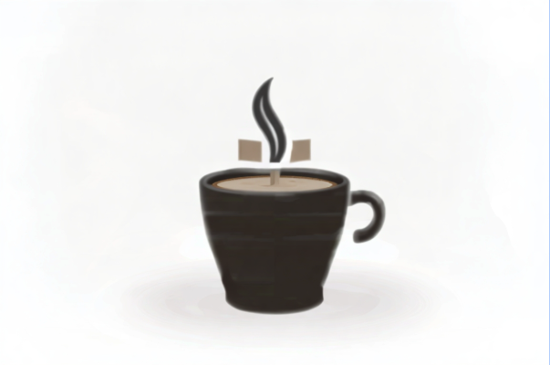
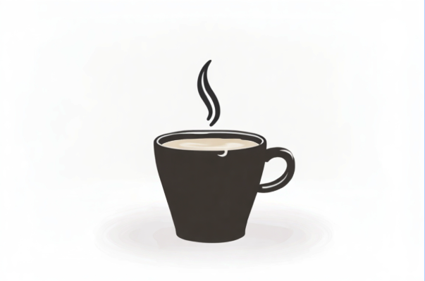
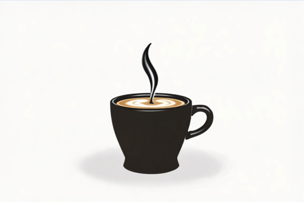
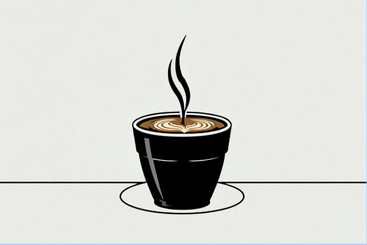

# Negative Prompt Tips

This model can understand and follow negative prompts. Negative prompts are a way to avoid undesired objects or behaviors of our model during the generation. For example, if you are creating a photo of a woman, but the model always decides to put on her glasses, you can avoid that by using the negative prompt “glasses”. However, the negative prompts also have a very powerful usage that is to fix the generated images. For example, if you are creating a photo of a woman, but the model always generates a blurry image, you can avoid that by using the negative prompt “blurry”.

F Lite model is specially sensitive to negative prompts and, the negative prompt used will depend on the kind of image you are creating, for example, if you are creating a photo of a model in front of a camera probably using the prompt: “A photo of a man”, the result could be this:

The first thing you can notice is the “plastic skin”, to avoid that and make it more realistic you can use as negative prompt:
“plastic skin, rubbery skin, silicone, waxy texture, glossy plastic, shiny plastic, artificial skin, mannequin-like, porcelain, vinyl, over-smooth skin, unnatural sheen”

And the result would be much more realistic:

Look! The skin is fixed! However, we can see some malformations in the hand, the lips,…so, we can improve our negative prompt to avoid malformations like this:
“distorted proportions, deformed, bad anatomy, extra limbs, missing limbs, disfigured face, poorly drawn hands, poorly rendered face,  mutation”
We concatenate both to avoid the plastic textures and all the malformations and here is the result:

As you can see, the choice of the negative prompt depends on the kind of image you are creating. 

## Vectors

As you can see, the choice of the negative prompt depends on the kind of image you are creating. 

In the case in that you want to create a logo for a coffee shop using this prompt:
“a vector image of a black logo of a cup of coffee over a plain flat white background”

You might get something like this:

The first thing we can see is the weird squared-texture inside the cup and even in the background. To avoid that, we used the negative prompt:
“texture, textured surface, grain, noise, roughness”

Textures are gone; however, now, the image is a little bit blurry. We are going to add “blurry, smudged, softened” to our negative prompt, and voila!

Now we can see some “malformations”, the lines are not perfect and we want it perfect. To do that, we can add: 
“sketchy strokes, wobbling outlines, rough edges, blurred lines, inconsistent strokes”
 To our negative prompt, and now it is much better!

As an extra tip, for vectors we recommend using AGP:

